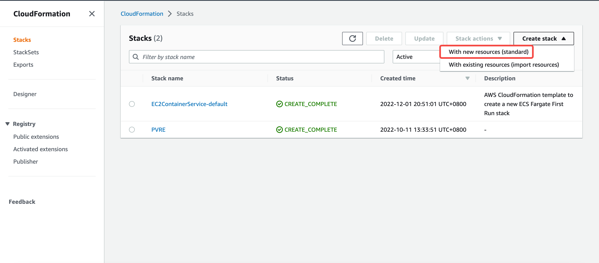

# Axios Based HTTP Testing Tool

The solution is for deploying an axios based HTTP testing tool solution on AWS.
##  Target Audience
Who needs 
- A One-Click solution for setup an axios based HTTP testing tool on Amazon EC2
- A promise based http client with a visual user interface
- A Less Operation Effort solution via AWS managed service

## Technical Details

### The Axios Components

In this solution, we deploy the following axios components:
- Web UI based on HTML
- An JavaScript file that contains all axios's source code
- An Apache HTTP server that provides HTTP service and  hosts HTML and JavaScript files mentioned above

### Solution Architecture on AWS 


The architecture details:

1. This solution supports deployment in any Availability Zone.

2. Amazon VPC: Build a reliable and secure virtual network, and deploy the resources in the public subnet of the VPC.

3. Amazon EC2: Use EC2 instance to deploy all components of this solution, including Apache HTTP server, HTML, JavaScript, and use the latest Amazon Linux 2 AMI for the EC2 instance as default.


## How to deploy
### Prerequisites

Please clone the or download the repository from github:

If you have git installed, run the following command in the terminal at any writable directory:
```
git clone https://github.com/aws-samples/axios-based-http-testing-tool.git
```


If you don't have git installed, you can download the repository on github, visit this url ( [https://github.com/aws-samples/axios-based-http-testing-tool](https://github.com/aws-samples/axios-based-http-testing-tool) ) and download the repository as a ZIP file, after downloading, unzip the downloaded file:


The directory structure is like:

The YAML file named "Axios-Based-HTTP-Testing-Tool.yaml" will be used in the following steps.

### Steps to set up Axios Based HTTP Testing Tool

Please follow the subsequent steps to set up Axios Based HTTP Testing Tool on AWS CloudFormation.

1. Open CloudFormation console, click "Create stack" button and choose "With new resources (standard)" option:


2. Now we entered "Create stack" step, select "Template is ready" in "Prerequisite - Prepare template" section which is actived by default, select "Upload a template file" in "Specify template" section and click "Choose file" button to open the uploading window:  

     
3. Choose "Axios-Based-HTTP-Testing-Tool.yaml" in the uploading window:


4. After file choosing, the name of the file "Axios-Based-HTTP-Testing-Tool.yaml" will appeared aside "Choose file" button, now we can click "Next" button to continue:


5. Now we entered "Specify stack details" step, enter a stack name in the "Stack name" section, then select an existing EC2 KeyPair to enable SSH access to the instances for "KeyName" in the "Parameters" section, "LatestAmiId" has an default value which stand for the latest AMI of "Amazon Linux 2", you can keep this default value in most circumstance. After filling this fields, click "Next" button:


6. In the "Configure stack options" step, you can just keep the default values or modify some fields as needed:

Click "Next" button to continue:


7. The next step is "Review", here we can review the whole configuration we just made, if there is no problem, click "Submit" button to start the progress of stack creation:


8. Now the creation progress is starting, we can see events in the "Events" panel and we can also manually refresh events by click "Refresh" button:


9. When the creation progress completed, we can switch to the "Outputs" panel and the visit URL of axios will be shown in the panel:


10. Visit the URL, and we can see the UI of the HTTP testing tool featured by axios, now we successfully finished the deployment section.


### Using Axios Based HTTP Testing Tool

1. Base on the API you want to test, filling the fields like URL, Method, Params and Headers, please use valid JSON in Params and Headers fields, then click "Send Request" button, request information will be shown in "Request" section, and the result of the request will be shown in "Response" section:


2. If a failure occured, corresponding messages will be appeared in the "ERROR" section:
